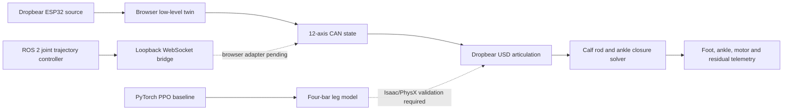

# Dropbear Control

Source-grounded low-level control, browser digital twin, ROS 2 trajectory
passthrough, and constrained walking-RL tooling for the Dropbear humanoid.


> [!IMPORTANT]
> This repository is currently a software-in-the-loop engineering system. It
> does not authorize powered-robot motion, establish actuator suitability, or
> replace Isaac/PhysX, HIL, calibration, limit, and physical safety validation.

## Overview

`dropbear_control` joins four previously separate concerns into one auditable
workspace:

- the observed two-ESP32 Dropbear low-level-control behavior and 12-node CAN
  map;
- the actual Dropbear USD structure, adapted into a browser-renderable cache
  while retaining its rigid bodies, physical joints, and loop closures;
- a ROS 2 Jazzy `joint_trajectory_controller` software-in-the-loop path; and
- a small PyTorch PPO baseline whose leg model exposes four-bar closure error.

The browser dashboard is the primary interactive surface. It renders the
Dropbear USD, drives the exact CAN-to-USD joint bindings, projects passive calf
and ankle joints against the retained closure anchors, and shows live motor,
foot-clearance, ankle, CAN, sensor, and closure telemetry.

## Current state

| Area | Implemented now | Boundary |
|---|---|---|
| Browser USD twin | 90 rendered bodies from a 294,204-triangle cache; manifest retains 93 rigid bodies, 116 physical joints, and 27 closures | Kinematic SIL visualization, not rigid-body dynamics |
| Low-level motor map | Twelve CAN nodes, `0x141`–`0x14C`, bound to the corresponding USD motor axes | Source-grounded simulation; no physical CAN authority |
| Calf/ankle linkage | Four X8 crank axes, tie rods, ankle contacts, foot pivot, and damped least-squares closure projection | Isaac/PhysX remains dynamics-authoritative |
| Knee safety datum | Both knees are limited to encoder `180°`–`360°`; ROS/RL use `0`–`π` rad from the same lock datum | Software constraint; not a certified physical stop |
| Walking demo | Forward alternating gait with loading, rearward push-off, early swing, moderated knee lift, advance, and placement | Demonstration trajectory, not a learned or dynamically stable gait |
| Actuator CAD | STEP-derived housing/output GLB previews, technical lines, explode control, and original STEP downloads | Browser previews are simplified visualization caches |
| Controller lab | Dimensional ESP32 DevKit reference with 19 source/inferred signal routes | Board-level visualization, not circuit simulation |
| Firmware console | Source-shaped serial grammar, task cadence, CAN traffic, sensor stream, and fault injection | Clean-room behavioral twin, not instruction-set emulation |
| ROS 2 | Jazzy bringup, `joint_trajectory_controller`, mock hardware, action/topic demo, validation, and local WebSocket bridge | ROS side is SIL; the dashboard does not yet auto-switch to WebSocket state |
| Walking RL | Dependency-light PyTorch PPO baseline with a constrained planar four-bar leg | Smoke-training baseline; not trained or validated in the full USD plant |
| Physical hardware path | Existing host, firmware, evidence, and fail-closed admission scaffolding | Deliberately disabled pending reviewed hardware evidence and HIL gates |

## Ground-truth revisions

The browser control twin is pinned to:

| Source | Revision | Use |
|---|---|---|
| [`Hyperspawn/Dropbear`](https://github.com/Hyperspawn/Dropbear/tree/main/Control%20System/Low%20Level%20Control) | `13cf5ecaa39b8b89c794fe905dcea0490cfa7726` | ESP32 task, pin, serial, sensor, and CAN behavior |
| [`Hyperspawn/dropbear_rl`](https://github.com/Hyperspawn/dropbear_rl) | `3c37aedce6d445205671d5714d05ae28b8c90e2c` | `dropbear.usd`, articulation topology, visual meshes, and closed-loop leg geometry |

The 402 MB source USD is not vendored. The tracked GLB is a decimated visual
cache, and `web/assets/robot/dropbear-articulation.json` retains the source
identity, body transforms, motor bindings, closure anchors, and browser
kinematic adaptations.

## System architecture



The browser and ROS/RL paths use the same knee-lock convention and twelve
semantic joint names, but they are not presented as equivalent physics
engines.

## CAN-to-USD map

| CAN | Low-level axis | USD joint | Motor/path role |
|---|---|---|---|
| `0x141` | Left outer calf | `LL_Revolute81` | RMD-X8 outer crank |
| `0x142` | Left inner calf | `LL_Revolute67` | RMD-X8 inner crank |
| `0x143` | Right inner calf | `RL_Revolute67` | RMD-X8 inner crank |
| `0x144` | Right outer calf | `RL_Revolute81` | RMD-X8 outer crank |
| `0x145` | Left knee | `LL_knee_actuator_joint` | Knee actuator |
| `0x146` | Left hip pitch | `LL_hip_joint` | Hip pitch actuator |
| `0x147` | Right hip pitch | `RL_hip_joint` | Hip pitch actuator |
| `0x148` | Right knee | `RL_knee_actuator_joint` | Knee actuator |
| `0x149` | Left hip yaw | `PG_left_leg_roll` | Physical hip yaw |
| `0x14A` | Left hip roll | `PG_left_leg_pitch` | Physical hip roll |
| `0x14B` | Right hip roll | `PG_right_leg_pitch` | Physical hip roll |
| `0x14C` | Right hip yaw | `PG_right_leg_roll` | Physical hip yaw |

The final four USD names are retained from the source asset. Their semantic
mapping is based on the authored world-space axes and body placement.

Each calf side is evaluated as:

```text
X8 motor crank → tie-rod pivot → ankle contact → foot rocker pivot
```

The right outer X8 uses an explicit mirrored-Z browser adaptation because this
USD revision authors `RL_Revolute81` as X while the mirrored mechanism and the
other three calf shafts are Z-aligned. The adaptation and its rationale are
recorded in the articulation manifest.

## Walking demonstration

The `Alternating step` scenario is a staged forward trajectory rather than a
set of phase-shifted sine waves. Each leg transitions through:

1. heel strike and loading;
2. mid-stance;
3. toe-off and an extended rearward push-off;
4. early swing;
5. moderated knee lift with greater forward hip pitch;
6. continued swing advance while the knee extends toward lock;
7. peak forward hip pitch at heel placement, followed by a loaded backward
   pull through stance.

The current target envelope never commands below the `180°` knee lock,
reaches that lock at heel strike, and limits peak gait knee demand to `232°`.
Hip pitch extends to approximately `25°` rearward during push-off, then
continues forward to `34°` as the knee reaches its heel-contact target. The leg
begins pulling backward only after contact becomes dominant. The viewport
correlates outer/inner X8 positions with solved ankle angle and foot-pivot
height, while the lower strip reports the worst retained-anchor residual.

This gait is useful for inspecting sign conventions, clearances, closure
behavior, and control timing. It is not evidence of balance or walk stability.

## Run the dashboard

Prerequisites are Python 3, Node.js, and npm.

```bash
git clone git@github.com:robit-man/dropbear_control.git
cd dropbear_control

cd web
npm ci
cd ..

python3 web/serve.py 8000
```

Open <http://localhost:8000>.

The dashboard starts in guarded pause even though the observed source firmware
sets `playMode=true` during setup. Press **RUN FULL DEMO** to start the forward
alternating gait.

The five engineering views are:

- **Robot Sim** — complete USD visualization, motor selection, live gait and
  linkage telemetry, faults, and configurable 50–200% render resolution;
- **Actuator CAD** — STEP-derived actuator solids with technical lines and
  articulation controls;
- **Controller Lab** — ESP32 board and pin/signal inspection;
- **Firmware** — two-controller serial/CAN behavioral console; and
- **Evidence** — source revisions, provenance, adaptations, and limitations.

## ROS 2 Jazzy SIL

The ROS package provides a twelve-axis
`joint_trajectory_controller/JointTrajectoryController` backed by
`mock_components/GenericSystem`.

```bash
sudo ros2_control/setup_ros2_jazzy.sh
source /opt/ros/jazzy/setup.bash

colcon build --symlink-install \
  --base-paths ros2_control/dropbear_trajectory_bringup \
  --build-base /tmp/dropbear_ros2_build \
  --install-base /tmp/dropbear_ros2_install \
  --log-base /tmp/dropbear_ros2_log

source /tmp/dropbear_ros2_install/setup.bash
ros2 launch dropbear_trajectory_bringup dropbear_trajectory.launch.py
```

Send a monitored example goal:

```bash
ros2 run dropbear_trajectory_bringup trajectory_demo \
  --amplitude 0.18 \
  --duration 3.0
```

The bridge exposes `ws://127.0.0.1:9091`, validates the exact joint set and
trajectory timing, and rejects negative knee coordinates. The current browser
dashboard uses its internal simulator; attaching its state/command path to the
bridge remains an explicit integration step.

See
[`ros2_control/dropbear_trajectory_bringup/README.md`](ros2_control/dropbear_trajectory_bringup/README.md)
for endpoints, inspection commands, and the hardware boundary.

## PyTorch walking baseline

Run a small PPO smoke-training job:

```bash
python3 -m rl.train_walk --updates 20 --steps 256 --device cpu
```

The default checkpoint is `artifacts/rl/dropbear_ppo.pt`. The environment
includes the four-bar closure residual in its observation and reward and
clamps negative knee coordinates before evaluating the constrained plant.

This is a research baseline only. A policy must be trained and evaluated in
the full Isaac/PhysX Dropbear environment, then replayed through the ROS 2 SIL
path before any separate HIL or physical admission work.

See [`rl/README.md`](rl/README.md) for the model boundary.

## Verification

With the dashboard server running:

```bash
cd web
npm test
npm run verify:dashboard
npm run test:visual
```

The web suite checks the source map, all twelve CAN bindings, X8 driver axes,
knee lock, staged gait, STEP/GLB availability, closure behavior, control
protocols, and the critical Playwright journey.

Run the ROS protocol and RL unit tests from the repository root:

```bash
PYTHONPATH=.:ros2_control/dropbear_trajectory_bringup \
python3 -m pytest -q \
  ros2_control/dropbear_trajectory_bringup/test/test_protocol.py \
  tests/rl/test_dropbear_ppo.py
```

For the much broader offline evidence, firmware, host, native, CAD, and safety
gate:

```bash
tools/test_all.sh
```

A passing software suite proves only the tested software boundary. It does not
prove physical motor-off behavior, HIL timing, exact actuator applicability,
plant fidelity, or safe powered operation.

## Repository layout

| Path | Purpose |
|---|---|
| `web/` | Five-view browser engineering dashboard and USD digital twin |
| `web/assets/robot/` | Optimized Dropbear GLB, articulation manifest, and attribution |
| `web/assets/cad/` | STEP-derived actuator browser caches |
| `rl/` | Constrained PyTorch PPO walking baseline |
| `ros2_control/dropbear_trajectory_bringup/` | ROS 2 Jazzy trajectory-controller SIL and dashboard bridge |
| `ros2_control/myactuator_dropbear_hardware/` | Existing fail-closed physical hardware plugin boundary |
| `firmware/esp32/` | ESP32/PAL and motor-driver scaffolding |
| `host/myactuator_lib/` | Host protocols, emulators, evidence, session, and safety tooling |
| `assets/` | Controlled source, CAD, calibration, graph, and review inputs |
| `generated/` | Reproducible evidence, CAD, plant, coverage, and review outputs |
| `schemas/` | Canonical configuration, evidence, plant, and admission contracts |
| `docs/` | Architecture, assessment, evidence, safety, and integration documents |
| `tools/` | Export, validation, generation, and complete-gate entry points |

Internal `myactuator` package and asset names are retained where they identify
the motor-vendor protocol/library domain; the GitHub repository itself is
`dropbear_control`.

## Evidence and safety boundary

The broader repository contains exact-source registries, deterministic
emulators, configuration admission, authorization, fault, audit, CAD, and
plant-review tooling. These are intentionally fail-closed:

- unreviewed motor tuples and plant facts do not become physical support;
- the tracked ROS hardware plugin does not acquire motion authority;
- synthetic positive tests are not treated as installed-unit evidence;
- browser closure quality is not rigid-body or contact validation; and
- software STOP/SHUTDOWN behavior is not claimed as a physical safe action.

Start with:

- [`web/README.md`](web/README.md) — dashboard, USD map, and browser boundary;
- [`docs/DROPBEAR_CONTROL_STACK_NOTES.md`](docs/DROPBEAR_CONTROL_STACK_NOTES.md)
  — observed low-level source audit;
- [`docs/CONTROL_STACK_TARGET.md`](docs/CONTROL_STACK_TARGET.md) — staged
  target architecture;
- [`docs/MYACTUATOR_ROS2_CONTROL_HANDOFF.md`](docs/MYACTUATOR_ROS2_CONTROL_HANDOFF.md)
  — fail-closed ROS hardware handoff; and
- [`docs/MYACTUATOR_LIBRARY_ASSESSMENT.md`](docs/MYACTUATOR_LIBRARY_ASSESSMENT.md)
  — host/firmware completeness assessment.

## License and attribution

Repository code and documents remain proprietary unless a file states
otherwise.

The Dropbear USD source is attributed to Hyperspawn Robotics — Priyanshu
Pareek and Cole Myers — and is licensed
[CC BY-NC-SA 4.0](https://creativecommons.org/licenses/by-nc-sa/4.0/).
The tracked browser GLB is an adapted, decimated rendering cache. Source hash,
revision, license, attribution, and transformation notes are retained in
`web/assets/robot/ATTRIBUTION.md` and the articulation manifest.
