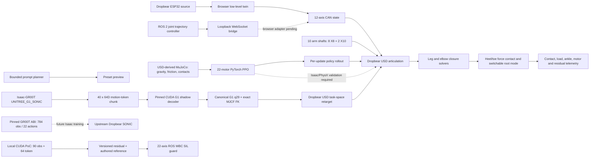

# Dropbear Control

Source-grounded low-level control, browser digital twin, ROS 2 trajectory
passthrough, and constrained walking-RL tooling for the Dropbear humanoid.


> [!IMPORTANT]
> This repository is currently a software-in-the-loop engineering system. It
> does not authorize powered-robot motion, establish actuator suitability, or
> replace Isaac/PhysX, HIL, calibration, limit, and physical safety validation.

## Overview

`dropbear_control` joins five previously separate concerns into one auditable
workspace:

- the observed two-ESP32 Dropbear low-level-control behavior and 12-node CAN
  map;
- the actual Dropbear USD structure, adapted into a browser-renderable cache
  while retaining its rigid bodies, physical joints, and loop closures;
- a ROS 2 Jazzy `joint_trajectory_controller` software-in-the-loop path;
- a 22-motor PyTorch PPO lab with a source-derived MuJoCo rigid-body backend,
  free-root balance, contact forces, center-of-mass, arm-swing, and retained
  leg/elbow loop-closure state; and
- a pinned GR00T-WBC Dropbear embodiment overlay plus a separately labelled
  CUDA compatibility controller for training/export/deployment plumbing.

The browser dashboard is the primary interactive surface. It renders the
Dropbear USD, drives the exact CAN-to-USD joint bindings, projects passive calf
and ankle joints against the retained closure anchors, exposes ten arm-motor
shafts, solves both five-link elbow assemblies, and resolves each heel/toe
patch against a unilateral ground plane.
Live telemetry covers motor state, foot contact and load, ankle state, CAN,
sensors, linkage closure, root attitude, policy reward, and live training
progress.

## Current state

| Area | Implemented now | Boundary |
|---|---|---|
| Browser USD twin | 90 rendered bodies from a 294,204-triangle cache; the source-physics manifest retains 93 rigid bodies, 93 masses/inertias, 93 collision groups, 117 physical joints, 29 force drives, and 27 retained closures | Browser playback is a synchronized renderer; training dynamics execute in the selected server-side backend |
| Leg motor map | Twelve low-level CAN nodes, `0x141`–`0x14C`, bound to the corresponding USD motor axes | Source-grounded simulation; no physical CAN authority |
| Arm motor map | Ten selectable USD shafts: eight RMD-X8 arm drives and two torso-mounted RMD-X10 shoulder-pitch drives | Arm CAN IDs are not present in the observed leg firmware and remain deliberately unmapped |
| Elbow linkage | `LH/RH_Revolute41` actuator input drives five passive joints against three retained loop constraints on each arm | Kinematic DLS closure; Isaac/PhysX remains dynamics-authoritative |
| Calf/ankle linkage | Four X8 crank axes, tie rods, ankle contacts, foot pivot, and damped least-squares closure projection | Isaac/PhysX remains dynamics-authoritative |
| Foot-ground contact | Actual foot-body bounds produce four patches; free-root mode integrates gravity and compliant unilateral normal force using the USD-authored `56.229 kg` mass, reports newtons/load, and enforces a non-penetration barrier | Force-based root contact is real but is not a 93-body collision solve; friction, self-collision, and full PhysX dynamics remain external |
| Root modes | Switchable Z guide plus free-root gravity/policy playback with visible height, roll, and pitch failure | Simplified browser free body; not a rigid-body solver |
| Knee safety datum | Both knees are limited to encoder `180°`–`360°`; ROS/RL use `0`–`π` rad from the same lock datum | Software constraint; not a certified physical stop |
| Walking demo | Forward alternating gait with loading, rearward push-off, early swing, moderated knee lift, advance, and placement | Demonstration trajectory, not a learned or dynamically stable gait |
| Actuator CAD | Automatic X8/X10 selection from the active Dropbear axis; exact source STEP-derived housing/output previews articulate coaxially about X8 `+Y` and X10 `+Z`, with technical lines, explode control, and original STEP downloads | Visual B-Rep partitions, not calibrated dynamics/support authority |
| Controller lab | Dimensional ESP32 DevKit reference with 19 source/inferred signal routes | Board-level visualization, not circuit simulation |
| Firmware console | Source-shaped serial grammar, task cadence, CAN traffic, sensor stream, and fault injection | Clean-room behavioral twin, not instruction-set emulation |
| ROS 2 | Jazzy bringup, `joint_trajectory_controller`, mock hardware, action/topic demo, validation, and local WebSocket bridge | ROS side is SIL; the dashboard does not yet auto-switch to WebSocket state |
| GR00T-WBC / G1 bridge | Pinned upstream revision and native 22-action/784-observation ABI; digest-verified released G1 CUDA decoder; exact G1 MJCF FK; 40×64 token-stream handling; body-space retargeting through the retained 93-body Dropbear USD graph and passive loops; exact q[22] browser/WBC frames | Preview/teacher bridge only: downloaded weights remain ignored, contact dynamics remain Isaac/PhysX-authoritative, and no native Dropbear SONIC checkpoint or live Isaac-GR00T VLA server is claimed |
| CUDA compatibility controller | Local 90-observation + 64-token → 22-residual PyTorch controller; CUDA-only training by default; BF16/FP16 AMP; multi-A100; ONNX Runtime CUDA; guarded Torch/ONNX inference; TensorRT 10.13 engine build/numeric verification; persistent dashboard sessions | This is not NVIDIA SONIC, is not prompt-conditioned, and emits a residual around a required authored reference rather than a standalone trajectory |
| ROS 2 WBC guard | Exact 22-axis JSON contracts, 50 Hz watchdog, guarded activation, stand blending, knee envelope, hard/slew limits, and latched E-stop, always labelled `sil_only` | Separate from the existing 12-leg-axis JTC; no decoder→JTC or hardware transport is claimed |
| Prompt planner | Inspectable bounded language router and browser preset preview with a 64-D development token | Keyword planning only; its token schema is deliberately not admitted to the state-token-trained CUDA checkpoint |
| Walking RL | Local 22-action/90-observation PPO experiments launched from Robot Sim or RL Lab; source-derived MuJoCo or teaching-plant backend; 15 adjustable reward terms; tuned gentle-forward and circle-walk profiles; persistent sessions; checkpoint warm-start; update-by-update USD replay; free-root gravity/contact; 27 retained loop constraints; and a tracked 1,000-epoch reference policy | MuJoCo uses exact authored mass/inertia/joint data with inertia-derived collision proxies because the source USD collision groups do not expose finite external envelopes; Isaac/PhysX and hardware validation remain required |
| Physical hardware path | Existing host, firmware, evidence, and fail-closed admission scaffolding | Deliberately disabled pending reviewed hardware evidence and HIL gates |

## Ground-truth revisions

The browser control twin is pinned to:

| Source | Revision | Use |
|---|---|---|
| [`Hyperspawn/Dropbear`](https://github.com/Hyperspawn/Dropbear/tree/main/Control%20System/Low%20Level%20Control) | `13cf5ecaa39b8b89c794fe905dcea0490cfa7726` | ESP32 task, pin, serial, sensor, and CAN behavior |
| [`Hyperspawn/dropbear_rl`](https://github.com/Hyperspawn/dropbear_rl) | `3c37aedce6d445205671d5714d05ae28b8c90e2c` | `dropbear.usd`, articulation topology, visual meshes, and closed-loop leg geometry |

The 421,104,436-byte source USD is locally cached at
`artifacts/usd/dropbear.usd` and ignored by Git. Its SHA-256 is verified at
runtime. The tracked GLB is a decimated visual cache;
`web/assets/robot/dropbear-articulation.json` retains browser kinematics, while
`web/assets/robot/dropbear-physics-manifest.json` is extracted directly from
the source USD and retains its mass, inertia, collision, gravity, joint, and
force-drive contract.

Rebuild the local cache and tracked physics manifest with:

```bash
python3 tools/cache_dropbear_usd.py
python3 -m venv .physics-venv
.physics-venv/bin/pip install -r requirements-physics-lock.txt
.physics-venv/bin/python tools/export_dropbear_physics_manifest.py \
  artifacts/usd/dropbear.usd \
  web/assets/robot/dropbear-physics-manifest.json
```

## System architecture



The browser leg path and existing 12-axis ROS trajectory path use the same
knee-lock convention and twelve semantic leg names. The separate WBC contract
extends this to 22 motor axes, but none of these paths is presented as an
equivalent physics engine.

## CAN-to-USD map

| CAN | Low-level axis | USD joint | Motor/path role |
|---|---|---|---|
| `0x141` | Left outer calf | `LL_Revolute81` | RMD-X8 outer crank |
| `0x142` | Left inner calf | `LL_Revolute67` | RMD-X8 inner crank |
| `0x143` | Right inner calf | `RL_Revolute67` | RMD-X8 inner crank |
| `0x144` | Right outer calf | `RL_Revolute81` | RMD-X8 outer crank |
| `0x145` | Left knee | `LL_knee_actuator_joint` | Knee actuator |
| `0x146` | Left hip pitch | `LL_hip_joint` | Hip pitch actuator |
| `0x147` | Right hip pitch | `RL_hip_joint` | Hip pitch actuator |
| `0x148` | Right knee | `RL_knee_actuator_joint` | Knee actuator |
| `0x149` | Left hip yaw | `PG_left_leg_roll` | Physical hip yaw |
| `0x14A` | Left hip roll | `PG_left_leg_pitch` | Physical hip roll |
| `0x14B` | Right hip roll | `PG_right_leg_pitch` | Physical hip roll |
| `0x14C` | Right hip yaw | `PG_right_leg_roll` | Physical hip yaw |

The final four USD names are retained from the source asset. Their semantic
mapping is based on the authored world-space axes and body placement.

Each calf side is evaluated as:

```text
X8 motor crank → tie-rod pivot → ankle contact → foot rocker pivot
```

The right outer X8 uses an explicit mirrored-Z browser adaptation because this
USD revision authors `RL_Revolute81` as X while the mirrored mechanism and the
other three calf shafts are Z-aligned. The adaptation and its rationale are
recorded in the articulation manifest.

## Arm-motor-to-USD map

The arm category adds one inspectable shaft at each remaining authored arm
axis. The two shoulder-pitch motors attached to the torso are RMD-X10 units,
matching the hip-yaw motor class; all remaining arm motors are RMD-X8 units.

| Side | Physical axis | USD joint | Motor | Mount |
|---|---|---|---|---|
| Left | Shoulder pitch | `LH_yaw` | RMD-X10 | Torso |
| Left | Shoulder yaw | `LH_pitch` | RMD-X8 | Arm |
| Left | Shoulder roll | `LH_roll` | RMD-X8 | Arm |
| Left | Elbow pitch | `LH_Revolute41` | RMD-X8 | Arm |
| Left | Wrist roll | `LH_wrist_roll` | RMD-X8 | Arm |
| Right | Shoulder pitch | `RH_yaw` | RMD-X10 | Torso |
| Right | Shoulder yaw | `RH_pitch` | RMD-X8 | Arm |
| Right | Shoulder roll | `RH_roll` | RMD-X8 | Arm |
| Right | Elbow pitch | `RH_Revolute41` | RMD-X8 | Arm |
| Right | Wrist roll | `RH_wrist_roll` | RMD-X8 | Arm |

The source USD calls the torso-root axes `LH_yaw` and `RH_yaw`; the dashboard
keeps those authored names visible while applying the physical shoulder-pitch
semantic supplied for the installed robot. No arm CAN IDs are invented. The
arm inspector therefore reports `AUX · CAN UNMAPPED` until an authoritative
firmware or wiring map is added.

The two elbow motor rows are closed-loop inputs. `LH_elbow_joint` and
`RH_elbow_joint` are passive members, not motor commands. Each `Revolute41`
input is solved together with `Revolute42`, the passive elbow, `Revolute32`,
`Revolute33`, and `Revolute44` against `Revolute123`, `Revolute125`, and
`Revolute127`. The viewer reports arm and leg residuals independently.

## Foot contact and vertical constraint

The browser derives heel and toe patches from the lowest vertices of each
actual foot body in the current USD pose. Free-root contact then:

1. integrates the USD-authored `9.80665 m/s²` gravity;
2. solves compliant unilateral spring/damper normal forces at each patch;
3. uses the exact `56.2289776 kg` sum of all 93 authored body masses;
4. converts normal force to four inspectable load-cell values; and
5. applies a final non-penetration safety barrier so no rendered foot can pass
   through the floor.

Those four patch loads feed the dashboard’s optional load-cell channels, and
the root-Z offset and contact state remain inspectable in the robot view. This
lets a retracting foot settle naturally onto the rendered floor while the
walking motion continues.

The Z guide is switchable. With **RL policy playback** selected and the guide
disabled, the root enters a simple free-body mode: gravity is integrated,
feet retain unilateral floor contact, and the torso is free to lose height,
roll, and pitch. An untrained or failed policy therefore falls instead of
being held upright. Exported policies can drive the same root state from their
recorded height/attitude/contact sequence.

The browser root-contact kernel remains a lightweight playback model. RL runs
can now select `mujoco-usd-proxy-v1`, which compiles 90 connected USD bodies,
84 tree joints, all 27 retained closure constraints, and 22 actuators into
MuJoCo 3.6. It uses authored mass, COM, principal axes, inertia, joint limits,
gravity, friction, impact/contact forces, and a free floating base. Since the
source USD collision groups contain no usable finite external envelopes, the
local backend derives conservative ellipsoid collision proxies from each
body's inertia. These proxies currently collide with the floor only;
self-collision remains disabled until a source-grounded collision-pair filter
is available. The dashboard reports those limitations separately from
`isaac-physx-usd`, which remains the authoritative validation target when
Isaac Sim is installed.

## Walking demonstration

The `Alternating step` scenario is a staged forward trajectory rather than a
set of phase-shifted sine waves. Each leg transitions through:

1. heel strike and loading;
2. mid-stance;
3. toe-off and an extended rearward push-off;
4. early swing;
5. moderated knee lift with greater forward hip pitch;
6. continued swing advance while the knee extends toward lock;
7. peak forward hip pitch at heel placement, followed by a loaded backward
   pull through stance.

The current target envelope never commands below the `180°` knee lock,
reaches that lock at heel strike, and limits peak gait knee demand to `232°`.
Hip pitch extends to approximately `25°` rearward during push-off, then
continues forward to `34°` as the knee reaches its heel-contact target. The leg
begins pulling backward only after contact becomes dominant. The viewport
correlates outer/inner X8 positions with solved ankle angle and foot-pivot
height, while the lower strip reports the worst retained-anchor residual.

This gait is useful for inspecting sign conventions, clearances, closure
behavior, and control timing. It is not evidence of balance or walk stability.

## Run the dashboard

Prerequisites are Python 3, Node.js, and npm. The base dashboard can run under
the system interpreter; the GR00T compatibility lab requires the locked CUDA
runtime.

```bash
git clone git@github.com:robit-man/dropbear_control.git
cd dropbear_control

cd web
npm ci
cd ..

tools/setup_gr00t_runtime.sh
.gr00t-venv/bin/python web/serve.py 8000
```

Open <http://localhost:8000>.

On a non-CUDA workstation, use `python3 web/serve.py 8000`; the dashboard and
existing RL lab still run, while CUDA deployment gates remain visibly closed.
The server binds `127.0.0.1` by default. Browser mutations transparently fetch
a per-process control token and require same-origin JSON requests. Static
remote viewing can be enabled explicitly with
`DROPBEAR_DASHBOARD_HOST=<address> DROPBEAR_ALLOW_REMOTE=1`, but training,
prompt, and stop operations remain client-loopback-only.

The dashboard starts in guarded pause even though the observed source firmware
sets `playMode=true` during setup. Choose either **Presets** or **RL Policies**
in the Robot Sim source switch, select one source, and use the single top-bar
**Play/Stop** control. Selecting a source arms it without starting motion.
The Robot Sim training drawer can launch PPO and replay each completed update
on the same full USD stage; the global training strip retains experiment,
epoch, reward, and upright state while navigating among views.
The RL Lab’s **Training sessions** panel indexes every retained experiment.
Select any run to copy its exact optimizer, curriculum, guide, arm, and reward
parameters; optionally warm-start from its checkpoint; or replay its policy.
**New run** clears only the selection—stored history is never deleted.

The seven engineering views are:

- **Robot Sim** — complete USD visualization, motor selection, live gait and
  linkage/contact telemetry, separate leg and arm motor categories, faults,
  and configurable 50–200% render resolution;
- **Actuator CAD** — Dropbear-bound RMD-X8-25 Pro V2 and RMD-X10-100 S2 V3
  source STEP solids, correct source shaft axes, automatic selected-motor
  switching, technical lines, and articulation controls;
- **Controller Lab** — ESP32 board and pin/signal inspection;
- **Firmware** — two-controller serial/CAN behavioral console;
- **RL Lab** — advanced local PPO configuration and experiment diagnostics;
  source selection and playback remain unified on Robot Sim;
- **GR00T WBC** — pinned upstream ABI status, deterministic prompt planning,
  CUDA compatibility training/deployment checks, G1-to-USD retarget previews,
  and retained sessions; and
- **Evidence** — source revisions, provenance, adaptations, and limitations.

Robot Sim uses one Play control and two adjacent yellow text-only selectors.
`PRESET + CLASSIC` exposes the authored motion presets, `TRAINED + CLASSIC`
exposes the current RL policies and stored runs, and `TRAINED + GR00T`
replaces that dropdown with the verified G1/SONIC WBC bridge sources. The
state machine does not permit a misleading `PRESET + GR00T` combination.

## ROS 2 Jazzy SIL

The ROS package provides a twelve-axis
`joint_trajectory_controller/JointTrajectoryController` backed by
`mock_components/GenericSystem`.

```bash
sudo ros2_control/setup_ros2_jazzy.sh
source /opt/ros/jazzy/setup.bash

colcon --log-base /tmp/dropbear_ros2_log build --symlink-install \
  --base-paths ros2_control/dropbear_trajectory_bringup \
  --build-base /tmp/dropbear_ros2_build \
  --install-base /tmp/dropbear_ros2_install

source /tmp/dropbear_ros2_install/setup.bash
ros2 launch dropbear_trajectory_bringup dropbear_trajectory.launch.py
```

Send a monitored example goal:

```bash
ros2 run dropbear_trajectory_bringup trajectory_demo \
  --amplitude 0.18 \
  --duration 3.0
```

The bridge exposes `ws://127.0.0.1:9091`, validates the exact joint set and
trajectory timing, and rejects negative knee coordinates. The current browser
dashboard uses its internal simulator; attaching its state/command path to the
bridge remains an explicit integration step.

See
[`ros2_control/dropbear_trajectory_bringup/README.md`](ros2_control/dropbear_trajectory_bringup/README.md)
for endpoints, inspection commands, and the hardware boundary.

## PyTorch walking lab

Use **Train RL** on Robot Sim for a compact live run, or **RL Lab** for the
complete experiment configuration. Both feed the same site-wide training state
and update-by-update full-USD replay. For a command-line run:

```bash
python3 -m rl.train_walk \
  --updates 250 --steps 128 --envs 8 --epochs 4 --batch-size 512 \
  --motion-profile gentle-forward \
  --physics-backend mujoco-usd-proxy-v1 \
  --device cpu --no-vertical-constraint --arm-swing
```

The environment has 22 motor actions and 90 observations. Its leading reward
terms hold torso attitude/angular rate stable and minimize COM height/lateral
variation; the authored alternating walk supplies a smooth reference bias.
Speed/turn-rate tracking, half-cycle asynchronous symmetry, contact timing,
leg swing, knee contraction, contralateral arm swing, energy, action
smoothness, and all leg/elbow closure residuals remain explicit terms.
The dashboard accepts `1`–`10,000` training updates. Expand **Reward / Penalty
Bias** on either training form to set all 15 coefficients independently:
torso, COM, gait/contact, asynchronous symmetry, speed/turn, leg swing, height,
lateral tilt, dorsal tilt, knee contraction, arm swing, energy, smoothness,
closure, and fall. Zero disables a term, and the exact profile is written into
the experiment state, checkpoint, and exported browser policy.

**Gentle forward** is tuned for a casual `0.26 m/s` symmetric walk with strong
upright/COM terms, conservative knee depth, and natural arm counter-swing
(`250 updates × 4 PPO epochs = 1,000 epochs`). **Circle walk · left** targets
`0.22 m/s` and `0.28 rad/s`—a nominal `0.79 m` radius—with inner/outer stride
scaling, hip-yaw bias, a less rigid symmetry term, and stronger turn tracking.
Selecting a profile fills every optimizer, physics, motion, and reward field;
the resulting session remains freely editable and reproducible.

The same profile is available from the CLI, for example:

```bash
python3 -m rl.train_walk \
  --updates 250 --steps 128 --envs 8 --epochs 4 \
  --motion-profile gentle-forward --target-speed 0.26 \
  --physics-backend mujoco-usd-proxy-v1 \
  --reward-torso 1.75 --reward-com 1.20 \
  --reward-gait-contact 0.90 --reward-gait-symmetry 1.10 \
  --reward-leg-swing 0.28 --penalty-lateral-tilt 5.0 \
  --penalty-dorsal-tilt 4.5 --penalty-knee-contraction 0.18 \
  --device cpu --no-vertical-constraint --arm-swing
```

The actor mean is initialized to zero residual, so update zero is exactly the
working authored gait instead of a random corruption of it. Each deterministic
preview is evaluated on the same seed. The final checkpoint restores the
highest combined stability score observed during the complete run, while
retaining the selected update and completed-update count in its metadata.
`--init-checkpoint` supports an audited warm start and evaluates/protects that
state as update zero before optimization. The loopback dashboard service
accepts warm starts only from existing `.pt` files beneath
`artifacts/rl/experiments/`.

The local dashboard service exports a deterministic rollout after every PPO
update. **WATCH TRAINING LIVE** replays each new rollout on the full USD with
reward, upright rate, torso tilt, COM variation, speed, and fall telemetry.
Experiment checkpoints and policies live under `artifacts/rl/experiments/`.
**LOAD AUTHORED BASELINE** and **LOAD PPO REFERENCE** provide an immediate
same-view A/B replay after training.

Validate a completed 200 × 5 run against the authored residual-zero walk:

```bash
python3 -m rl.validate_walk \
  artifacts/rl/experiments/<experiment>/policy.json \
  --reference-policy-out \
    artifacts/rl/experiments/<experiment>/authored-reference.json \
  --out artifacts/rl/experiments/<experiment>/validation.json \
  --expected-policy-epochs 1000
```

### Tracked 1,000-epoch reference

The checked-in PPO reference is the stability-selected update `188` from a
complete `200 updates × 5 PPO epochs` CUDA run (`1,000` policy epochs, seed
`23`). Its deterministic eight-second free-root evaluation achieved:

| Metric | Authored walk | PPO reference | Change |
|---|---:|---:|---:|
| Upright time | 46.10% | 100.00% | +53.90 points |
| Mean torso tilt | 18.24° | 8.66° | −9.58° |
| Peak torso tilt | 41.43° | 11.02° | −30.41° |
| COM height range | 0.261 m | 0.044 m | −0.217 m |
| Mean forward speed | 0.336 m/s | 0.256 m/s | −0.080 m/s |
| Mean reward | 2.656 | 3.012 | +0.355 |

The subsequent full-USD browser A/B review also passed forward travel,
alternating support, foot clearance, free-root playback, hip/knee/arm motion,
and all browser loop-closure gates. The trained rollout travelled `2.044 m`;
its worst sampled leg and arm closure residuals were `0.465 mm` and
`0.154 mm`, respectively.

The reproducible artifacts are
[`dropbear-walk-reference.json`](web/assets/rl/dropbear-walk-reference.json),
[`dropbear-authored-reference.json`](web/assets/rl/dropbear-authored-reference.json),
[`dropbear-walk-validation.json`](web/assets/rl/dropbear-walk-validation.json),
and
[`dropbear-rendered-walk-review.json`](web/assets/rl/dropbear-rendered-walk-review.json).
Load the two policies with **LOAD PPO REFERENCE** and **LOAD AUTHORED
BASELINE** for the same-view comparison.

### GR00T-WBC and CUDA compatibility path

The repository pins NVIDIA GR00T-WholeBodyControl at
`4141c34280abb67c82e115342a8720f4a83d750d` and supplies a clean Dropbear
overlay: canonical 22-axis policy/source-USD/ROS ordering, the upstream
784-value native-decoder observation contract, closure validation, a
pinned-reader-shaped 50 Hz motion-reference bundle, source hashes, and the
upstream fixed-center action decoder. It also implements the otherwise missing
cross-embodiment preview path:

```text
UNITREE_G1_SONIC VLA [1,40,64]
  → verified released G1 CUDA decoder [1,994]→[1,29]
  → exact pinned G1 MJCF forward kinematics
  → limb-anchor-scaled body targets
  → retained Dropbear USD graph + passive-loop DLS
  → exact Dropbear q[22] preview/WBC references
```

This is body-space transfer, not joint-name copying. The decoder reconstructs
the official 994-value tensor layout using an explicit kinematic G1 shadow
history, applies the published action scales and standing offsets, and emits
canonical G1 motor coordinates. The shadow uses commanded q/dq, zero base
angular velocity, and upright projected gravity; it does not pretend to be
measured G1 plant/IMU state. Retargeting then solves for Dropbear's actual
motor shafts while evaluating the checked USD's 93-body graph and closed
knee/calf/elbow linkages. Full floating-base contact, constraint impulses, and
clip acceptance remain Isaac/PhysX responsibilities.

Reproduce the pinned source checkout and fetch the separately ignored,
SHA-256-verified released G1 decoder with:

```bash
tools/bootstrap_gr00t_wbc.sh
tools/fetch_gr00t_g1_decoder.sh
./.gr00t-venv/bin/python tools/verify_gr00t_g1_bridge.py \
  --device 0 \
  --output artifacts/rl/g1-usd-bridge-smoke-latest.json
```

The dashboard's `TRAINED + GR00T` playback family exposes both the published
G1 stand reference and **PINNED SONIC RELEASE STAND** through the same Play
button used by presets and RL. The latter executes the real CUDA-backed token
path and applies the resulting q[22] target to the rendered Dropbear USD. The
strict retarget API also accepts complete 1–40-frame token chunks and returns
Dropbear target frames on the upstream 50 Hz timeline with source/checkpoint
provenance and closure diagnostics. The HTTP path validates contiguous
sequence semantics but does not prove real-time decode cadence; the browser
schedules best-effort nominal 20 ms playback. The published stand latent is a
checkpoint-specific NVIDIA fixture, not a claim that an Isaac-GR00T VLA
generated it locally.
The checked A100 result is retained in
[`g1-usd-bridge-smoke-latest.json`](artifacts/rl/g1-usd-bridge-smoke-latest.json).

The runnable CUDA controller in this repository is intentionally a separate
compatibility prototype. It consumes 90 Dropbear state values plus a 64-value
reference token and emits 22 normalized residuals. Runtime targets are
reconstructed as:

```text
authored_reference[t] + clamp(residual, -1, 1) * action_scale * 0.62
```

That time-varying reference is mandatory; these artifacts are neither
upstream SONIC checkpoints nor standalone prompt-conditioned trajectories.
The dashboard’s natural-language box is an inspectable bounded preset planner,
not neural GR00T/VLA inference.

Set up and verify the local GPU path with:

```bash
tools/setup_gr00t_runtime.sh
DROPBEAR_CUDA_DEVICES=0 tools/verify_gr00t_cuda.sh
```

The verification performs an actual CUDA optimization update, exports ONNX,
compares ONNX Runtime CUDA numerically with PyTorch, builds a TensorRT 10.13
FP16 engine, compares that engine numerically, and checks the runtime
watchdog/limits. Multi-A100 training is supported through
`--devices 0,1,...`.

The current checked verification record is
`cuda-verified-20260724-r3` on an NVIDIA A100 80GB PCIe. It processed 2,048
training samples with 100% upright and 0% falls, measured a
`5.22e-8 m` maximum retained-closure residual, matched ONNX Runtime CUDA to
Torch within `1.14e-8`, and matched TensorRT 10.13.3.9 FP16 within
`3.39e-8`. Runtime admission now binds the checkpoint, completed session,
physical residual contract, exact 50 Hz reference, ONNX sidecar, and
TensorRT engine by recorded SHA-256 values. Dashboard sessions are not marked
complete until that deployment evidence passes.

The remaining upstream path is explicit: run the full constrained USD in
Isaac Lab/PhysX, collect accepted token/G1/Dropbear target clips, train a native
Dropbear 784→22 SONIC decoder, fine-tune or admit a
`UNITREE_G1_SONIC`/Dropbear language-and-vision policy boundary, and connect
only admitted radian references to a reviewed 22-axis ROS trajectory/hardware
transport. The geometric teacher bridge and package installation alone never
open those gates.

See
[`integrations/gr00t_wbc/README.md`](integrations/gr00t_wbc/README.md),
[`docs/GR00T_WBC_INTEGRATION.md`](docs/GR00T_WBC_INTEGRATION.md), and
[`ros2_control/dropbear_wbc_controller/README.md`](ros2_control/dropbear_wbc_controller/README.md)
for the exact contracts and blockers.

This is a research baseline only. A policy must be trained and evaluated in
the full Isaac/PhysX Dropbear environment, then replayed through the ROS 2 SIL
path before any separate HIL or physical admission work.

See [`rl/README.md`](rl/README.md) for the model boundary.

## Verification

With the dashboard server running:

```bash
cd web
npm test
npm run verify:dashboard
npm run test:visual
```

For a rendered trained-versus-authored review, pass the two server-relative
policy URLs to `npm run test:walk-policy`. It samples both trajectories on the
full USD, checks forward travel, alternating support, foot clearance, arm/leg
motion, free-root playback, and closure residuals, and captures both poses.
The committed review report records the exact acceptance result for the
tracked pair.

The web suite checks the source map, all twelve leg CAN bindings, all ten arm
shafts and their 8× X8 / 2× X10 split, both three-constraint elbow linkages,
heel/toe contact loads, guided and free-root behavior, live policy playback,
knee lock, staged gait, STEP/GLB availability, closure behavior, control
protocols, and the critical Playwright journey.

Run the GR00T overlay, CUDA-controller, ROS protocol, and RL unit tests from
the repository root:

```bash
PYTHONPATH=.:ros2_control/dropbear_trajectory_bringup:ros2_control/dropbear_wbc_controller \
python3 -m pytest -q \
  tests/gr00t_wbc \
  tests/rl \
  ros2_control/dropbear_trajectory_bringup/test \
  ros2_control/dropbear_wbc_controller/test
```

Run the real CUDA/ONNX/TensorRT admission smoke separately:

```bash
tools/setup_gr00t_runtime.sh
DROPBEAR_CUDA_DEVICES=0 tools/verify_gr00t_cuda.sh
```

For the much broader offline evidence, firmware, host, native, CAD, and safety
gate:

```bash
tools/test_all.sh
```

A passing software suite proves only the tested software boundary. It does not
prove physical motor-off behavior, HIL timing, exact actuator applicability,
plant fidelity, or safe powered operation.

## Repository layout

| Path | Purpose |
|---|---|
| `web/` | Seven-view browser engineering dashboard, USD twin, PPO service, and GR00T compatibility lab |
| `web/assets/robot/` | Optimized Dropbear GLB, articulation manifest, and attribution |
| `web/assets/cad/` | STEP-derived actuator browser caches |
| `integrations/gr00t_wbc/` | Pinned 22-action/784-observation upstream overlay, order/closure adapters, and 50 Hz reference contract |
| `rl/` | 22-motor free-root PPO lab plus the separately versioned CUDA 90+64 residual compatibility controller |
| `ros2_control/dropbear_trajectory_bringup/` | ROS 2 Jazzy trajectory-controller SIL and dashboard bridge |
| `ros2_control/dropbear_wbc_controller/` | Exact 22-axis, 50 Hz guarded JSON WBC SIL boundary |
| `ros2_control/myactuator_dropbear_hardware/` | Existing fail-closed physical hardware plugin boundary |
| `firmware/esp32/` | ESP32/PAL and motor-driver scaffolding |
| `host/myactuator_lib/` | Host protocols, emulators, evidence, session, and safety tooling |
| `assets/` | Controlled source, CAD, calibration, graph, and review inputs |
| `generated/` | Reproducible evidence, CAD, plant, coverage, and review outputs |
| `schemas/` | Canonical configuration, evidence, plant, and admission contracts |
| `docs/` | Architecture, assessment, evidence, safety, and integration documents |
| `tools/` | Export, validation, generation, and complete-gate entry points |

Internal `myactuator` package and asset names are retained where they identify
the motor-vendor protocol/library domain; the GitHub repository itself is
`dropbear_control`.

## Evidence and safety boundary

The broader repository contains exact-source registries, deterministic
emulators, configuration admission, authorization, fault, audit, CAD, and
plant-review tooling. These are intentionally fail-closed:

- unreviewed motor tuples and plant facts do not become physical support;
- the tracked ROS hardware plugin does not acquire motion authority;
- synthetic positive tests are not treated as installed-unit evidence;
- browser closure quality is not rigid-body or contact validation; and
- software STOP/SHUTDOWN behavior is not claimed as a physical safe action.

Start with:

- [`web/README.md`](web/README.md) — dashboard, USD map, and browser boundary;
- [`docs/DROPBEAR_CONTROL_STACK_NOTES.md`](docs/DROPBEAR_CONTROL_STACK_NOTES.md)
  — observed low-level source audit;
- [`docs/CONTROL_STACK_TARGET.md`](docs/CONTROL_STACK_TARGET.md) — staged
  target architecture;
- [`docs/MYACTUATOR_ROS2_CONTROL_HANDOFF.md`](docs/MYACTUATOR_ROS2_CONTROL_HANDOFF.md)
  — fail-closed ROS hardware handoff; and
- [`docs/MYACTUATOR_LIBRARY_ASSESSMENT.md`](docs/MYACTUATOR_LIBRARY_ASSESSMENT.md)
  — host/firmware completeness assessment.

## License and attribution

Repository code and documents remain proprietary unless a file states
otherwise.

The Dropbear USD source is attributed to Hyperspawn Robotics — Priyanshu
Pareek and Cole Myers — and is licensed
[CC BY-NC-SA 4.0](https://creativecommons.org/licenses/by-nc-sa/4.0/).
The tracked browser GLB is an adapted, decimated rendering cache. Source hash,
revision, license, attribution, and transformation notes are retained in
`web/assets/robot/ATTRIBUTION.md` and the articulation manifest.
