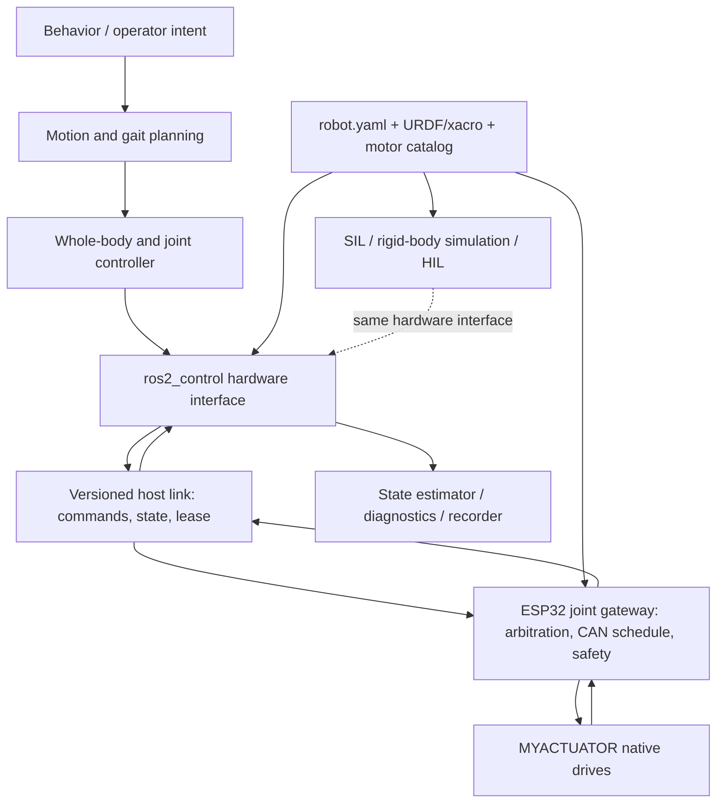

# Target Dropbear control and simulation architecture

## Architectural rule

Each command has one owner, one unit convention, one expiration time, and one
observable acknowledgement. The motor's embedded drive closes its supported
inner loops; the ESP32 owns deterministic bus scheduling and safety; the host
owns robot-level joint control; higher layers consume and produce timestamped
robot state through stable interfaces.



## Layer responsibilities

| Layer | Owns | Must not own |
|---|---|---|
| MYACTUATOR drive | vendor current/velocity/position loops, native limits and faults | robot gait or cross-joint policy |
| ESP32 gateway | CAN scheduling, response correlation, command arbitration, lease/watchdog, local limit enforcement, calibrated sensor acquisition, motor-off state | web UI, gait planning, two independent torque writers |
| Host hardware API | stable joint command/state interface, configuration identity, timestamps, diagnostics | vendor-byte assumptions in every consumer |
| Robot control | joint/whole-body control and estimator integration | direct serial strings or direct CAN ownership |
| Planning/behavior | trajectories, gait, operator/autonomy intent | physical safety bypasses |
| Simulation/testing | protocol emulator, plant and whole-robot backends behind the same interfaces | a separate joint naming/unit system |

## Canonical interfaces

### Native actuator protocol

Implement a versioned codec per actual vendor protocol generation. Keep byte
encoding separate from model parameters and transport. Every command and status
response needs golden vectors derived from the official manual and confirmed by
CAN captures. Unknown firmware/model combinations fail closed.

### ESP32-to-host link

Use a framed binary protocol suitable for USB serial initially. The existing
64-byte frame can evolve, but must gain an explicit protocol version and
documented state machine. Required fields include:

- message type, source/destination node, sequence, monotonic timestamp;
- configuration/schema hash;
- command mode and values in SI units;
- validity/lease duration and requested enable state;
- joint state position, velocity, effort/current and sample timestamp;
- actuator temperature, voltage, status/error words and bus health;
- acknowledgement/result tied to sequence;
- CRC and stream resynchronization;
- negotiated rates/capabilities.

The ESP32 must drop expired commands, reject invalid transitions, and enter a
verified safe state on host loss. Diagnostics and configuration traffic must be
bounded so it cannot starve the control schedule.

### Robot hardware interface

Expose standard joint position, velocity, effort, temperature, voltage, fault,
and connectivity state through a `ros2_control` `SystemInterface`. Hardware,
protocol-emulated SIL, and whole-robot simulation should implement the same
interface. URDF/xacro transmissions, limits, axes, inertias, and collision
geometry are generated or validated against `robot.yaml`.

## Simulator architecture

### Asset pipeline

```text
official ZIP + SHA-256
  -> preserved vendor STEP
  -> reviewed CAD import and unit/orientation normalization
  -> housing/output segmentation and joint-frame annotation
  -> visual GLB + collision mesh + metadata
  -> URDF/xacro and browser catalog
  -> geometric regression renders and axis/scale tests
```

Do not use production STEP tessellation directly at runtime. The 26 assembly
files may expose separable components, but their names are not sufficient to
identify the output automatically. The 27 flattened files need manual review or
replacement source geometry. Each converted asset is accepted only after a
rotation test proves the intended output member moves around the correct axis
while the housing remains fixed.

### Simulation levels

| Level | Purpose | Required behavior |
|---|---|---|
| Protocol emulator | Driver development and fault injection | exact frames, timing, mode transitions, status/fault behavior |
| Actuator plant | Gains, saturation, thermal and latency studies | electrical/mechanical/thermal parameter set with uncertainty and recorded source |
| Whole robot | Kinematics, contacts, estimator and controller integration | canonical robot description, sensors, contact model, same hardware API |
| HIL | Timing and gateway validation | real ESP32 and bus schedule against emulated or unloaded actuators |

Use URDF/xacro and the joint registry as the engine-neutral source. Select the
primary rigid-body engine with a short benchmark covering contact stability,
controller integration, deterministic replay, CI headlessness, and developer
workflow. The existing Three.js UI remains a diagnostics/catalog client and can
consume the same GLB assets and recorded telemetry.

## Safety state machine

Minimum gateway states:

```text
BOOT -> DISCOVERY -> DISABLED -> ARMED -> ENABLED
             |          |          |        |
             +----------+----------+------> FAULT
                                             |
                                      explicit verified reset
```

- `BOOT`: outputs uncommanded; self-test and configuration verification only.
- `DISCOVERY`: identify expected nodes and validate model/firmware/capabilities.
- `DISABLED`: motor-off command repeatedly verified; telemetry available.
- `ARMED`: host lease valid and all prerequisites satisfied; zero effort.
- `ENABLED`: one selected command mode and one writer; all commands expire.
- `FAULT`: immediately request motor-off, latch cause/evidence, require an
  authorized reset after prerequisites recover.

A physical power-removal path remains independent of software.

## Delivery sequence and gates

1. **P0 — Preserve and freeze the prototype.** Record exact hardware topology,
   motor models/firmware, bus ownership, IDs, wiring, power limits, and current
   calibrations. Create safety bench procedures. No unloaded/unsupported
   assumptions become truth.

2. **P1 — Establish protocol truth.** Replace invented draft contracts with
   versioned official-source notes, golden vectors, capture fixtures, and one
   canonical joint/config schema. Gate: codecs pass vectors on host and ESP32.

3. **P2 — One motor, one safe gateway.** Implement real CAN TX/RX, model-aware
   units, response polling, status/faults, arbitration, and lease timeout. Gate:
   8-hour current-limited bench run plus disconnect/fault/stop injection.

4. **P3 — One six-joint leg.** Enforce per-node bus ownership, schedule within
   measured bus utilization, integrate sensors/calibration, and expose the
   versioned host link. Gate: deterministic timing, no missed watchdogs, all
   motor-off paths verified.

5. **P4 — Catalog and actuator simulation.** Convert and review all 44 assets,
   add model parameter provenance, protocol emulation, plant models, and CAD
   regression tests. Gate: 44/44 assets pass scale/axis/housing-output review;
   every claimed model has an evidence row.

6. **P5 — Consolidate the Dropbear digital twin.** Select and validate the
   existing detailed/simplified URDF, Gazebo and Isaac assets; remove generated
   duplicates; then reconcile transmissions, inertias, collisions, sensors and
   two-leg topology with the canonical registry. Gate: joint/schema parity
   between robot, host, firmware and simulator.

7. **P6 — Robot control integration.** Implement the hardware interface,
   estimator, joint controller and recorded replay. Gate: identical controller
   tests against simulator and current-limited hardware with bounded error.

8. **P7 — Locomotion and behavior.** Add whole-body control, gait planning,
   behavior and operator tools only after lower-layer timing and safety gates.

## Evidence matrix

Track support by exact tuple, not family name:

```text
(model, drive firmware, protocol version, transport, control mode)
  specification source
  codec vectors
  simulator asset/parameters
  SIL result
  bench/HIL result
  limits/faults result
  last verified hardware and date
```

The public API and UI should derive support claims from this evidence matrix.
