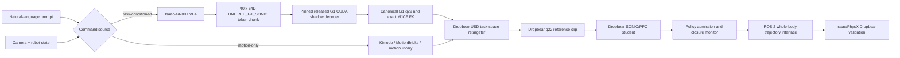

# GR00T Whole-Body Control integration for Dropbear

## Decision

Use GR00T/SONIC as a high-level motion and task teacher, not as a direct
Dropbear motor source.

The released SONIC deployment is a Unitree G1 controller. Its default runtime
decodes 64-dimensional motion tokens at 50 Hz for a 29-DOF G1, while its VLA
path consumes camera/state/language observations and emits a 78-dimensional
action: 64 motion-token values plus two seven-joint hands. Dropbear currently
has a verified 22-motor policy order, four retained closed-chain mechanisms,
and no equivalent hand action space. Passing G1 joint targets directly to
Dropbear would scramble semantics and bypass its leg and elbow closures.

The implemented preview/teacher architecture and the eventual native path are
therefore:



The browser remains the prompt, experiment, policy-selection, and live
visualization surface. GPU inference and Isaac Lab training belong in a
separate local or remote service.

## Delivered state and contract split

The repository contains a pinned source overlay, a runnable bridge around the
separately downloaded released G1 decoder, and a separate local CUDA
compatibility proof of concept. Their policy interfaces are intentionally
different:

| Path | Observation input | Action output | Current role |
| --- | --- | --- | --- |
| Pinned upstream Dropbear overlay | One 784-value SONIC decoder observation, including the 64-value motion token and ten-frame histories | 22 normalized motor residuals | Target ABI for a native Dropbear encoder/decoder in the pinned upstream Isaac Lab stack |
| Released G1 shadow + USD retarget | NVIDIA motion-token frames `[1..40,64]`, decoded through the official G1 `[1,994]→[1,29]` ONNX | Closure-evaluated absolute Dropbear q[22] frames | Online preview and offline teacher-data generation against the actual retained Dropbear USD graph |
| Local compatibility PoC | 90 current Dropbear observations plus a separate 64-value compatibility token | 22 residual actions | Fast teaching-plant training, CUDA/ONNX comparison, safety-runtime tests, and TensorRT engine-build verification |

The local `90 + 64` model is not the upstream decoder, is not compatible with
released G1 weights, and is not evidence that a native Dropbear SONIC
checkpoint exists.

Delivered integration material includes:

- the canonical 22-motor policy, source-USD, and ROS 2 SIL orders, plus
  declared—but not asset-derived—target orders for Isaac Lab and MuJoCo;
- a versioned 784-input/22-output overlay contract and seed Hydra
  configuration;
- source hashes and structural checks for 93 rigid bodies, 116 articulation
  joints, 117 source-physics joints, 27 retained constraints, and every
  commanded motor binding;
- order conversion plus fail-closed reduced knee/calf/elbow closure adapters;
- an exact-50-Hz reference converter with versioned JSON and CSV output;
- explicit patch points and licensing records for the pinned upstream commit;
- a SHA-256-pinned CUDA-only G1 SONIC shadow decoder with the exact 994-value
  tensor layout populated by explicit kinematic shadow state, action scaling,
  order conversion, optional timestamp cadence checks, and fail-closed
  tensor/provider checks;
- exact G1 MJCF forward kinematics and retained 93-body Dropbear USD forward
  kinematics with all browser-projected passive-loop solves;
- limb-anchor-scaled body-space retargeting for feet, lower legs, shoulders,
  forearms, and wrists, returning exact Dropbear q[22] target frames;
- a strict loopback API for decoded G1 q[29], one verified token, or a complete
  1–40-frame token horizon, plus nominal best-effort 20 ms browser scheduling;
- a guarded 22-axis ROS 2 **SIL-only** JSON boundary; and
- local Torch CUDA training/export, ONNX Runtime CUDA comparison,
  safety-runtime checks, and TensorRT 10.13 engine-build verification.

The last checked local admission run,
`cuda-verified-20260724-r3`, executed on an NVIDIA A100 80GB PCIe and passed
Torch CUDA training, ONNX Runtime CUDA, watchdog/future-frame rejection, and
TensorRT 10.13.3.9 FP16 numerical checks. Its maximum ONNX and TensorRT
differences were `1.14e-8` and `3.39e-8`; the teaching-plant closure maximum
was `5.22e-8 m`. These results establish only the local compatibility
pipeline.

Training and deployment are one lifecycle in the dashboard service:
`running → deployment_pending → complete`. Completion requires matching
checkpoint/session contracts, SHA-256-bound ONNX and TensorRT artifacts,
CUDA-provider execution, and TensorRT numerical evidence. A dashboard restart
terminates a matching orphan process group and restores an interrupted state.
Mutation endpoints are loopback-only, same-origin, strict-JSON, and protected
by a per-process control token.

The 50 Hz converter emits the pinned reader's root-only `joint_pos.csv`,
`joint_vel.csv`, `body_pos.csv`, `body_quat.csv`, and `metadata.txt` layout.
The Isaac body index and 22-axis Isaac/MuJoCo orders remain preflight targets
until registered assets are generated and parity-tested.
`rl.sonic_reference.SonicReferenceDataset.from_json()` also adapts that bundle
into the local compatibility trainer under strict order/frequency checks. This
does not make the local 90+64 model an upstream 784-input decoder.

Not delivered are Isaac Lab registration/execution, force-authoritative
contact validation, a Dropbear-native SONIC checkpoint, an installed N1.7
Isaac-GR00T policy server with camera/state observations, or hardware
authority. The G1 decoder is used as a shadow teacher; its output is not
relabeled as Dropbear dynamics.

## Why pose transfer is useful

Pose transfer provides a common intermediate representation between a
G1-trained teacher and Dropbear:

1. Generate or select a human/SMPL/G1 whole-body motion aligned with a prompt.
2. Convert every frame to task-space targets: root, torso, wrists, elbows,
   knees, heels, toes, contacts, and heading.
3. Solve those targets for Dropbear's **actuated motor coordinates**, not for
   similarly named visible joints.
4. Replay the result on the full Dropbear USD and reject frames that violate a
   loop, joint limit, contact condition, speed limit, or ground constraint.
5. Use accepted trajectories as reference-motion bias or imitation data for a
   Dropbear-native policy.

This is immediately useful for locomotion styles, gestures, crouching,
reaching, and coordinated arm/leg timing. Pose transfer alone is insufficient
for object manipulation: prompts such as “pick up the cup” also require camera
observations, object state, contact-aware data, and task-success supervision.

## Constrained Dropbear retargeting

Let `x_t` contain the teacher's body targets at frame `t`, and let `q_t` be the
22 Dropbear motor coordinates in the existing policy order. Solve:

```text
min q_t
    w_pose    || FK_dropbear(q_t) - x_t ||²
  + w_vel     || q_t - q_(t-1) ||²
  + w_contact || foot_state(q_t) - contact_target_t ||²
  + w_effort  || q_t - q_neutral ||²

subject to
  c_left_leg(q_t)  = 0
  c_right_leg(q_t) = 0
  c_left_arm(q_t)  = 0
  c_right_arm(q_t) = 0
  0 <= q_left_knee, q_right_knee <= pi
  actuator position/velocity/effort envelopes
  unilateral heel/toe ground constraints
```

The four calf X8 coordinates must be solved from ankle/foot targets through
the three-point linkage. The two elbow motor coordinates must be solved
through each five-passive-joint, three-constraint linkage. The passive knee,
ankle, and elbow visuals are outputs of those closures and must never become
independent policy actions.

Retargeting acceptance for every clip:

- all 22 values and velocities finite and in range;
- leg and elbow closure residual below `0.5 mm` in the browser solver and the
  stricter Isaac/PhysX threshold chosen for training;
- no knee command below the `180°` lock datum (`0 rad` in policy/ROS space);
- no foot penetration, unsupported root teleport, or contact discontinuity;
- recorded parity for body/DOF ordering among USD, Isaac Lab, MuJoCo, policy
  JSON, and ROS 2 before admitting a clip;
- deterministic replay hash and prompt/source provenance retained.

## Integration stages

### Stage 0 — Freeze the embodiment contract

The canonical 22-axis source overlay, order converter, source verification,
reduced closure checks, and guarded ROS 2 SIL boundary are delivered. Remaining
embodiment work is to:

- export an authoritative Dropbear MJCF for reference-motion forward
  kinematics and prove parity with the source USD;
- register and exercise the source USD with all 27 constraints in Isaac/PhysX;
- characterize X8/X10 inertia, effort, velocity, stiffness, and damping;
- connect the 22-axis SIL contract to a real
  `joint_trajectory_controller`/simulation transport; and
- leave physical arm CAN assignments and all hardware output disabled until
  separately characterized and admitted.

The existing ROS mock description is a passthrough fixture, not a kinematic
robot model, and cannot be the GR00T embodiment description.

### Stage 1 — G1 token-to-Dropbear USD preview

This stage is implemented with no hardware output:

```text
POST /api/gr00t/retarget
{
  "schema": "dropbear-gr00t-retarget-request-v1",
  "sessionId": "vla-rollout-001",
  "sequence": 0,
  "source": {
    "kind": "nvidia-sonic-motion-token-chunk",
    "schema": "nvidia-gr00t-sonic-motion-token-chunk-40x64-v1",
    "motionTokenChunk": [[/* 64 finite values */]],
    "producer": "isaac-gr00t-policy-server",
    "checkpoint": "sha256:<checkpoint>",
    "sequenceStart": 0
  }
}
```

The service validates the complete token horizon before advancing the
stateful decoder, fills the exact 994-value tensor layout from a declared
kinematic shadow history, runs the released decoder with CUDA and no CPU
fallback, evaluates the G1 pose in the pinned MJCF, and solves body targets on
the Dropbear USD graph. The response includes every
G1 q[29] and Dropbear q[22] frame, source/checkpoint provenance, passive angles,
closure residuals, task error, and a ROS WBC reference.

The current deterministic prompt router is only a bounded preview/catalog
router. It does not run a VLA, infer a learned token, or prove
language-conditioned control. A real N1.7 `PolicyServer` must still supply the
official `UNITREE_G1_SONIC` action arrays from camera/state/language
observations. An external caller forwards its validated output at the token
boundary above; deterministic catalog tokens are rejected.

### Stage 2 — Distill into the current Dropbear trainer

Feed accepted `q[22]`, root, body, and contact sequences into the existing
PyTorch plant as selectable reference motions. Extend its reward profile with
per-clip imitation terms while retaining torso, COM, contact, energy,
smoothness, closure, and fall terms.

The current local plant uses the `90 + 64` compatibility contract. Its tested
reference loader accepts the exact 50 Hz upstream bundle and generates
deterministic state tokens when the bundle contains no learned token. That
loader is a data adapter, not a model-ABI adapter.

Recommended curriculum:

1. vertical guide on, reference tracking only;
2. vertical guide on, randomized mass/gains/contact;
3. guide off, stable root and COM;
4. disturbances and reference transitions;
5. prompt-conditioned clip switching;
6. Isaac/PhysX evaluation on the original constrained USD.

The current hand-authored walk remains a protected baseline and fallback.

### Stage 3 — Add a native SONIC Dropbear embodiment

Follow NVIDIA's new-embodiment path in an external, commit-pinned
GR00T-WholeBodyControl checkout:

- Dropbear USD/URDF assets for Isaac Lab and a matching MJCF;
- `gear_sonic/envs/manager_env/robots/dropbear.py`;
- explicit Isaac Lab ↔ MuJoCo DOF/body mappings;
- X8/X10 actuator groups, action scales, effort limits, KP/KD, and armatures;
- Dropbear body names for pelvis/torso, wrists, elbows, heels, and toes;
- a `DropbearConverter`;
- `sonic_dropbear.yaml`;
- retargeted PKL motion data with mirrored clips and matching SMPL data;
- a Dropbear-specific encoder/decoder export and observation configuration.

Start with one visible environment, validate order and closure, then scale.
Do not assume that a 64-dimensional G1 token has the same meaning in a newly
trained Dropbear latent space. A cross-embodiment token is valid only after
joint training or a measured latent adapter.

### Stage 4 — Task-conditioned VLA

After the native whole-body controller is stable:

- register a Dropbear embodiment/modality configuration in Isaac-GR00T;
- provide simulated or physical ego-camera observations;
- provide all 22 motor states, base quaternion, projected gravity, contacts,
  and required timestamps;
- fine-tune on prompt-labelled Dropbear demonstrations;
- return bounded action chunks to the Dropbear decoder, never raw hardware
  positions;
- preserve pause, initial-pose blending, stale-action skipping, and a
  watchdog at the 50 Hz controller boundary.

The prompt layer should select goals and motion tokens. The lower layer remains
responsible for balance, contacts, linkage closure, joint limits, and safe
tracking.

## Runtime boundary

Keep the large Isaac-GR00T model optional and out of the dashboard process.
The repository provides a standalone compatible client for Isaac-GR00T's ZMQ
`PolicyClient`/`PolicyServer` contract on port 5550. The dashboard does not
instantiate or configure that client and does not claim server reachability;
an external adapter must call the client and forward validated token chunks to
the HTTP retarget endpoint. A `get_action` response contains
`motion_token [1,40,64]`, `left_hand_joints [1,40,7]`, and
`right_hand_joints [1,40,7]` for the `UNITREE_G1_SONIC` embodiment. Dropbear
currently consumes only the whole-body motion token; the G1-specific hands
have no Dropbear motor counterpart.

```text
optional Isaac-GR00T PolicyServer :5550
  ↕ safe ZMQ REQ/REP through standalone G1SonicPolicyClient
external caller/adapter (not auto-wired)
  ↓ validated UNITREE_G1_SONIC token chunk over strict loopback HTTP
Dropbear G1-shadow/retarget boundary :8000
  → released G1 CUDA decoder → exact G1 FK → Dropbear USD retarget
  ↕ browser preview, provenance, and telemetry
  ↕ decoded 50 Hz radian-reference contract
22-axis ROS 2 SIL guard
  ↕ simulation transport
Isaac/PhysX validation backend (not delivered)
```

Pin the upstream commit and download model weights into an ignored local
cache. Do not commit multi-gigabyte upstream checkpoints into this repository.
GR00T source is Apache-2.0; released weights use the NVIDIA Open Model License,
so retain attribution and review the model terms independently of Dropbear's
USD asset license.

## Current admission gates

| Gate | State |
| --- | --- |
| Source/ordering contract | Delivered and covered by offline checks |
| G1 token bridge | Delivered: pinned CUDA decoder, exact tensor layout/order/FK with declared kinematic shadow state, 1–40-frame token contract, and checkpoint-specific release fixture |
| Dropbear USD pose transfer | Delivered for preview/teacher data: retained 93-body graph, body-space DLS, and passive knee/calf/elbow solves; collision response and constraint impulses remain Isaac/PhysX responsibilities |
| Local CUDA compatibility PoC | Verified on A100: Torch CUDA training, ONNX Runtime CUDA comparison, safety-runtime checks, and TensorRT 10.13.3.9 FP16 engine build/numerical verification |
| Native upstream Dropbear SONIC | Blocked on upstream registration, an Isaac run, retargeted training data, and a Dropbear checkpoint |
| Natural-language VLA | Wire/output contract is implemented; blocked on a compatible N1.7 PolicyServer/checkpoint, camera/state modalities, and prompt-labelled demonstrations |
| Authoritative physics | Blocked until the original USD passes recorded Isaac/PhysX gravity, contact, collision, and closure evaluation |
| ROS 2 | Guarded 22-axis SIL messages only; no physical output authority |

## First implementation slice

Status of the smallest honest prototype:

1. **Delivered:** source verification, canonical order conversion, reduced
   closure projection, and exact-50-Hz reference conversion.
2. **Partial:** the local CUDA compatibility trainer and guarded 22-axis ROS 2
   SIL boundary exist, but use local schemas rather than the native upstream
   ABI.
3. **Partial:** a deterministic prompt box can resolve bounded phrases to an
   accepted local clip catalog; it is not VLA inference.
4. **Delivered:** released-token → CUDA G1 decoder → exact G1 MJCF FK →
   constrained Dropbear USD q[22] preview, including full 40-frame horizons.
5. **Delivered for geometry:** retained USD tree/passive-loop evaluation and
   browser playback. **Remaining:** force-authoritative Isaac/PhysX settling,
   contact rejection, and accepted-clip persistence.
6. **Remaining:** run representative N1.7 prompt/camera rollouts through the
   bridge, compare them with the authored gait, and curate accepted teacher
   clips.
7. **Remaining:** patch/register the overlay in the pinned upstream checkout,
   run Isaac/PhysX validation, and train/export a native 784-input/22-output
   checkpoint.

Completing those gates creates the evidence needed for a native SONIC
embodiment and, later, a task-conditioned VLA path. Until then, catalog-driven
preview and the local compatibility PoC must remain visibly labelled as such.

## Upstream references

- [GR00T Whole-Body Control](https://github.com/NVlabs/GR00T-WholeBodyControl)
- [Training on new embodiments](https://github.com/NVlabs/GR00T-WholeBodyControl/blob/main/docs/source/user_guide/new_embodiments.md)
- [VLA inference runtime](https://github.com/NVlabs/GR00T-WholeBodyControl/blob/main/docs/source/tutorials/vla_inference.md)
- [SONIC motion-reference format](https://github.com/NVlabs/GR00T-WholeBodyControl/blob/main/docs/source/references/motion_reference.md)
- [MotionBricks representation](https://github.com/NVlabs/GR00T-WholeBodyControl/blob/main/motionbricks/docs/motion_representation.md)
- [MotionBricks custom datasets](https://github.com/NVlabs/GR00T-WholeBodyControl/blob/main/motionbricks/docs/adding_your_own_dataset.md)
