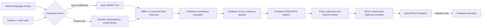

# GR00T Whole-Body Control integration for Dropbear

## Decision

Use GR00T/SONIC as a high-level motion and task teacher, not as a direct
Dropbear motor source.

The released SONIC deployment is a Unitree G1 controller. Its default runtime
decodes 64-dimensional motion tokens at 50 Hz for a 29-DOF G1, while its VLA
path consumes camera/state/language observations and emits a 78-dimensional
action: 64 motion-token values plus two seven-joint hands. Dropbear currently
has a verified 22-motor policy order, four retained closed-chain mechanisms,
and no equivalent hand action space. Passing G1 joint targets directly to
Dropbear would scramble semantics and bypass its leg and elbow closures.

The target architecture is therefore:



The browser remains the prompt, experiment, policy-selection, and live
visualization surface. GPU inference and Isaac Lab training belong in a
separate local or remote service.

## Why pose transfer is useful

Pose transfer provides a common intermediate representation between a
G1-trained teacher and Dropbear:

1. Generate or select a human/SMPL/G1 whole-body motion aligned with a prompt.
2. Convert every frame to task-space targets: root, torso, wrists, elbows,
   knees, heels, toes, contacts, and heading.
3. Solve those targets for Dropbear's **actuated motor coordinates**, not for
   similarly named visible joints.
4. Replay the result on the full Dropbear USD and reject frames that violate a
   loop, joint limit, contact condition, speed limit, or ground constraint.
5. Use accepted trajectories as reference-motion bias or imitation data for a
   Dropbear-native policy.

This is immediately useful for locomotion styles, gestures, crouching,
reaching, and coordinated arm/leg timing. Pose transfer alone is insufficient
for object manipulation: prompts such as “pick up the cup” also require camera
observations, object state, contact-aware data, and task-success supervision.

## Constrained Dropbear retargeting

Let `x_t` contain the teacher's body targets at frame `t`, and let `q_t` be the
22 Dropbear motor coordinates in the existing policy order. Solve:

```text
min q_t
    w_pose    || FK_dropbear(q_t) - x_t ||²
  + w_vel     || q_t - q_(t-1) ||²
  + w_contact || foot_state(q_t) - contact_target_t ||²
  + w_effort  || q_t - q_neutral ||²

subject to
  c_left_leg(q_t)  = 0
  c_right_leg(q_t) = 0
  c_left_arm(q_t)  = 0
  c_right_arm(q_t) = 0
  0 <= q_left_knee, q_right_knee <= pi
  actuator position/velocity/effort envelopes
  unilateral heel/toe ground constraints
```

The four calf X8 coordinates must be solved from ankle/foot targets through
the three-point linkage. The two elbow motor coordinates must be solved
through each five-passive-joint, three-constraint linkage. The passive knee,
ankle, and elbow visuals are outputs of those closures and must never become
independent policy actions.

Retargeting acceptance for every clip:

- all 22 values and velocities finite and in range;
- leg and elbow closure residual below `0.5 mm` in the browser solver and the
  stricter Isaac/PhysX threshold chosen for training;
- no knee command below the `180°` lock datum (`0 rad` in policy/ROS space);
- no foot penetration, unsupported root teleport, or contact discontinuity;
- equivalent body ordering in USD, Isaac Lab, MuJoCo, policy JSON, and ROS 2;
- deterministic replay hash and prompt/source provenance retained.

## Integration stages

### Stage 0 — Freeze the embodiment contract

Before importing GR00T code:

- define the canonical 22-axis Dropbear order from `rl.ACTION_NAMES`;
- add full body/joint/body-order tables for USD, Isaac Lab, MuJoCo, browser,
  and ROS;
- export an authoritative Dropbear MJCF for reference-motion forward
  kinematics;
- preserve the source USD and all 27 constraints for Isaac/PhysX;
- characterize X8/X10 inertia, effort, velocity, stiffness, and damping;
- expand ROS 2 from its current 12-leg-axis interface to the same 22-axis
  whole-body contract, without inventing physical CAN assignments for arms.

The existing ROS mock description is a passthrough fixture, not a kinematic
robot model, and cannot be the GR00T embodiment description.

### Stage 1 — Offline prompt-to-pose preview

Build a GPU-side `groot_adapter` process with no hardware output:

```text
POST /v1/motions
{
  "prompt": "walk forward cautiously with relaxed arm swing",
  "durationSeconds": 6,
  "speed": 0.25,
  "source": "vla | kimodo | motionbricks | library"
}
```

The result is a versioned canonical body-motion clip, followed by a constrained
Dropbear `q[22]` clip. Store prompt, model/checkpoint hashes, source frames,
retarget metrics, contacts, and rejection reasons. The dashboard should show
teacher pose, retargeted Dropbear pose, and closure/contact residuals side by
side before a clip can become training data.

This stage delivers meaningful language-directed simulation without claiming
that the released G1 controller runs Dropbear.

### Stage 2 — Distill into the current Dropbear trainer

Feed accepted `q[22]`, root, body, and contact sequences into the existing
PyTorch plant as selectable reference motions. Extend its reward profile with
per-clip imitation terms while retaining torso, COM, contact, energy,
smoothness, closure, and fall terms.

Recommended curriculum:

1. vertical guide on, reference tracking only;
2. vertical guide on, randomized mass/gains/contact;
3. guide off, stable root and COM;
4. disturbances and reference transitions;
5. prompt-conditioned clip switching;
6. Isaac/PhysX evaluation on the original constrained USD.

The current hand-authored walk remains a protected baseline and fallback.

### Stage 3 — Add a native SONIC Dropbear embodiment

Follow NVIDIA's new-embodiment path in an external, commit-pinned
GR00T-WholeBodyControl checkout:

- Dropbear USD/URDF assets for Isaac Lab and a matching MJCF;
- `gear_sonic/envs/manager_env/robots/dropbear.py`;
- explicit Isaac Lab ↔ MuJoCo DOF/body mappings;
- X8/X10 actuator groups, action scales, effort limits, KP/KD, and armatures;
- Dropbear body names for pelvis/torso, wrists, elbows, heels, and toes;
- a `DropbearConverter`;
- `sonic_dropbear.yaml`;
- retargeted PKL motion data with mirrored clips and matching SMPL data;
- a Dropbear-specific encoder/decoder export and observation configuration.

Start with one visible environment, validate order and closure, then scale.
Do not assume that a 64-dimensional G1 token has the same meaning in a newly
trained Dropbear latent space. A cross-embodiment token is valid only after
joint training or a measured latent adapter.

### Stage 4 — Task-conditioned VLA

After the native whole-body controller is stable:

- register a Dropbear embodiment/modality configuration in Isaac-GR00T;
- provide simulated or physical ego-camera observations;
- provide all 22 motor states, base quaternion, projected gravity, contacts,
  and required timestamps;
- fine-tune on prompt-labelled Dropbear demonstrations;
- return bounded action chunks to the Dropbear decoder, never raw hardware
  positions;
- preserve pause, initial-pose blending, stale-action skipping, and a
  watchdog at the 50 Hz controller boundary.

The prompt layer should select goals and motion tokens. The lower layer remains
responsible for balance, contacts, linkage closure, joint limits, and safe
tracking.

## Runtime boundary

Keep GR00T optional and out of the dashboard process:

```text
browser :8000
  ↕ WebSocket/HTTP (prompt, preview, telemetry)
groot_adapter (Python, GPU)
  ↕ ZMQ REQ/REP to Isaac-GR00T PolicyServer
dropbear_wbc (PyTorch/ONNX/TensorRT, 50 Hz)
  ↕ ROS 2 topics/actions
dropbear policy admission + mock/Isaac/hardware backend
```

Pin the upstream commit and download model weights into an ignored local
cache. Do not commit multi-gigabyte upstream checkpoints into this repository.
GR00T source is Apache-2.0; released weights use the NVIDIA Open Model License,
so retain attribution and review the model terms independently of Dropbear's
USD asset license.

## First implementation slice

The smallest honest prototype is:

1. generate a Dropbear MJCF/tree projection from the ground-truth USD;
2. implement `DropbearOrderConverter` and the constrained retarget objective;
3. import one G1/SMPL walking clip and one upper-body gesture;
4. produce accepted Dropbear `q[22]` policy JSON;
5. replay both on the full browser USD;
6. use each as a selectable training reference;
7. compare reference, learned result, and authored walk numerically and
   visually;
8. only then add a prompt box that resolves prompts to the accepted clip
   catalog.

This yields a testable pose-transfer bridge quickly and creates the data needed
for a later native SONIC/VLA embodiment.

## Upstream references

- [GR00T Whole-Body Control](https://github.com/NVlabs/GR00T-WholeBodyControl)
- [Training on new embodiments](https://github.com/NVlabs/GR00T-WholeBodyControl/blob/main/docs/source/user_guide/new_embodiments.md)
- [VLA inference runtime](https://github.com/NVlabs/GR00T-WholeBodyControl/blob/main/docs/source/tutorials/vla_inference.md)
- [SONIC motion-reference format](https://github.com/NVlabs/GR00T-WholeBodyControl/blob/main/docs/source/references/motion_reference.md)
- [MotionBricks representation](https://github.com/NVlabs/GR00T-WholeBodyControl/blob/main/motionbricks/docs/motion_representation.md)
- [MotionBricks custom datasets](https://github.com/NVlabs/GR00T-WholeBodyControl/blob/main/motionbricks/docs/adding_your_own_dataset.md)
